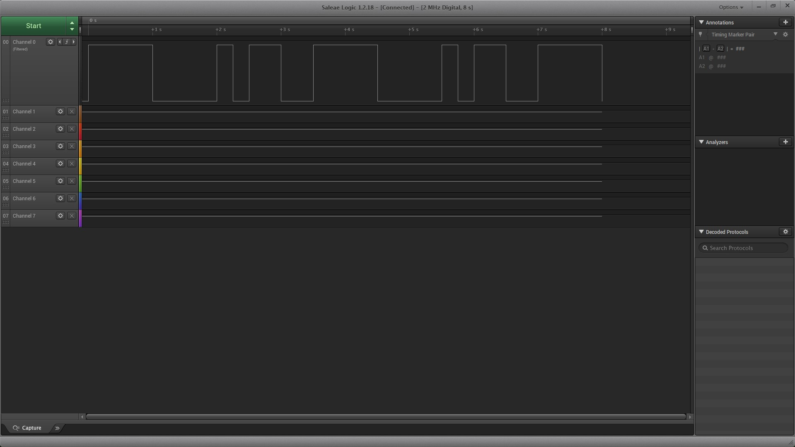
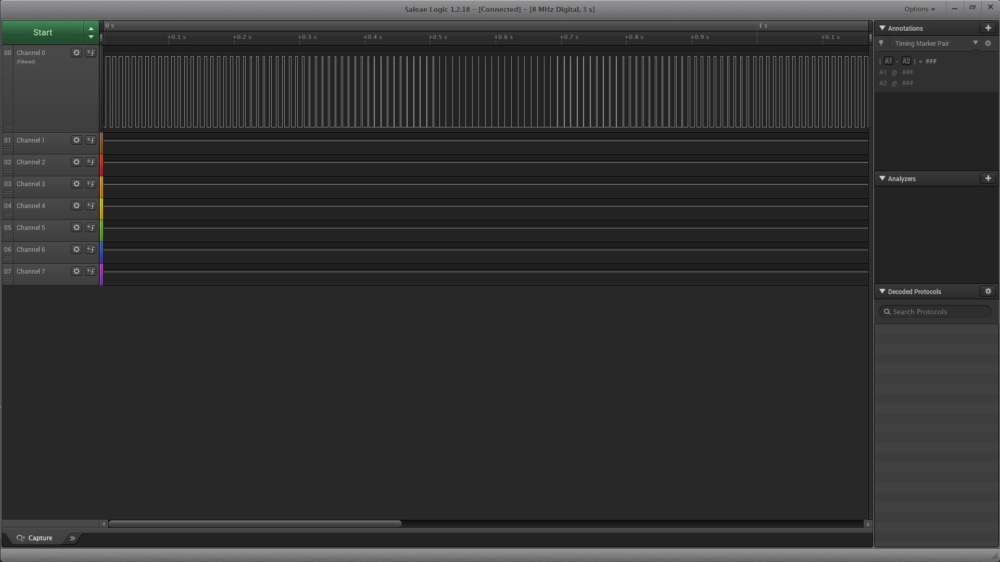
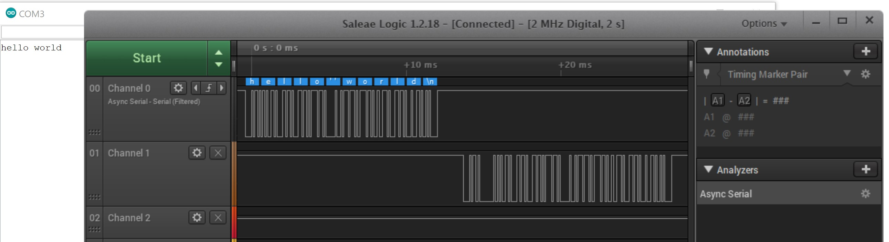
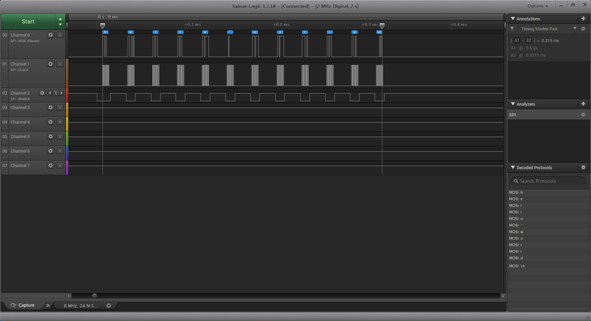

Name: Zahid Hossain

EID: zh4757

Team Number: 8

## Questions

1. Why does your program need a setup and a loop?

    The setup is required to initialize things like setting pins as either input or output. The loop is required to continuously run code.

2. What is the downside to putting all your code in a loop?

    Putting all your code in a loop becomes messy and harder to read as your program gets larger. Organizing the code with extra functions makes the code more "modular" and more easy to read, and a function can make it easier to repeat a set of instructions.

3. Why does your code need to be compiled?

    The code has to be compiled into machine code that the board can actually understand.

4. When lowering the frequency in procedure A, step 4, what is going wrong? Brainstorm some solutions. Dimmers exist in the real world. What is their solution?

    The frequency is becoming so low that our eyes can actually perceive the periods of time in which the LED is off, creating a flickering effect. I suppose one solution I can think of is to keep the on-off flickering frequency high. Real world solutions that I saw were using certain dimming drivers that are tailored for LEDs, and as long as the frequency is kept at a non noticeable level, flickering won't be an issue.

5. Why do you need to connect the logic analyzer ground to the ESP32 ground?

    Without a ground connection, the circuit won't be closed properly, and the logic analyzer wouldn't be able to properly measure a signal.

6. What is the difference between synchronous and asynchronous communication?

    Synchronous requires an external clock to synchronize the communication decoding. Asynchronous does not need that, relying on different internal signals in the transmission.

7. Profile of UART: Sent X bytes in Y time 

    Sent 12 bytes in 12.404ms

8. Profile of SPI: Sent X bytes in Y time

    Sent 12 bytes in 0.315ms

9. Why is SPI so much faster than UART?

    It has more lines of communication, with distinct connections from master to slave and vice versa, making communication faster

10. list one pro and one con of UART

    Pro: Less wires Con: Slower communication

11. list one pro and one con of SPI

    Pro: Faster communication Con: More wires required

12. list one pro and one con of I2C

    Pro: Less data lines reqeuired Con: Slower communication

13. Why does I2C need external resistors to work?

    Each signal line on the I2C bus needs a pull-up resistor to restore the signal to high since device bus drivers can only pull the signal low

## Screenshots

Procedure A, step 1:

Procedure A, step 4:

Procedure B, UART:

Procedure B, SPI:

